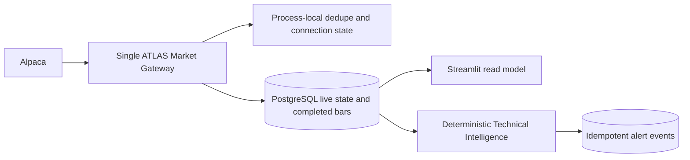

# ATLAS Phase 8A live-market foundation

## Service boundaries

- A separately deployed gateway process is the only owner of the Alpaca
  WebSocket. Streamlit never imports or constructs a stream client.
- `SubscriptionManager` reduces customer watchlists, portfolios, ATLAS
  candidates, the scanner universe, and on-demand requests to one unique
  symbol union. A symbol's lowest numbered tier is its effective priority.
- `LiveMarketGateway` owns reconnects, bounded exponential backoff, dynamic
  subscriptions, event deduplication, ordering, freshness, gap repair, and the
  completed-bar handoff.
- Technical Intelligence consumes completed normalized bars. It returns one of
  the reserved deterministic states; an LLM may explain but never choose it.
- Alert delivery first persists a unique fingerprint. Optional explanation is
  downstream and cannot block or duplicate delivery.

## Semantic boundary

`LiveMarketState.live_price` is never written into scanner rows. The following
remain distinct: `signal_price`, `live_price`, entry zone, canonical Atlas fair
value, Wall Street consensus, decision targets, and trade targets.

## Storage ownership

PostgreSQL stores watchlists, symbol demand, latest shared live state,
completed bars, deterministic technical state, alert events, and recipient
delivery state. Process memory holds only the active connection, subscription
set, heartbeat, and bounded dedupe cache. Redis is not required for one gateway
replica; it becomes useful later for leader election/pub-sub when horizontal
gateway replication is justified.

## Failure behavior

Disconnect marks existing states stale while retaining the last value and
timestamp. Stale/degraded state suppresses live-confirmation alerts. After
reconnect the gateway reapplies the unique desired symbol union, repairs short
missing completed-bar gaps through REST, and sends repaired bars through the
same deterministic technical interface. Event and alert fingerprints prevent
reconnect or Streamlit reruns from duplicating customer alerts.

## Scaling assumptions

Customer count is not provider connection count. One gateway connection serves
the unique union of followed symbols. For hundreds of symbols, use dynamic tier
promotion and subscribe to the lowest-volume sufficient channels. Streamlit
reads shared state; it performs no provider calls and no duplicate technical
calculation. A durable worker platform such as Render is appropriate for the
long-lived gateway; GitHub Actions and Streamlit are not.

The provider adapter and production deployment are deliberately absent from
Phase 8A. The `feed` setting can move from `iex` to `sip` without changing any
consumer schema.
